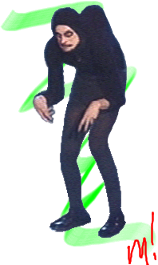
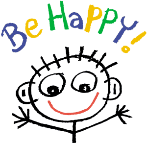

!SLIDE center

#  JavaScript #

!SLIDE center

JavaScript

!SLIDE center

!SLIDE center

JavaScript

!SLIDE center incremental

* Prosty (serio) język..
* ...który kompiluje się do Javascriptu.
* Wygląda dobrze.
* Tylko tyle.
* I Aż tyle.

!SLIDE incremental

### Żegnajcie średniki i nawiasy ###

    @@@ ruby
    # Assignment:
    number   = 42
    opposite = true

    # Conditions:
    number = -42 if opposite

    # Arrays:
    list = [1, 2, 3, 4, 5]

    # Existence:
    alert "I knew it!" if elvis?

!SLIDE 

### Funkcje ###

    @@@ ruby
    square = (x) -> x * x
    
____

    @@@ javascript
    var square;
    square = function(x) {
      return x * x;
    };

!SLIDE 

### Widoczność zmiennych ###

    @@@ ruby
    outer = 1
    changeNumbers = ->
      inner = -1
      outer = 10
    inner = changeNumbers()

____

    @@@ javascript
    var changeNumbers, inner, outer;
    outer = 1;
    changeNumbers = function() {
      var inner;
      inner = -1;
      return outer = 10;
    };
    inner = changeNumbers();

!SLIDE center

## Nie ma zmiennych globalnych ##

!SLIDE

### Wcięcia (Python, YAML)###

    @@@ ruby
    wrug =
      drogomir_talk:
        name: "Fixtures"
      czak_talk:
        name: "Websockets"
        live: true

____

    @@@ javascript
    var wrug;
    wrug = {
      drogomir_talk: {
        name: "Fixtures" },
      czak_talk: {
        name: "Websockets",
        live: true
      }
    };
    
!SLIDE 

### Klasy ###

    @@@ ruby
    class Animal
      constructor: (@name) ->

      move: (meters) ->
        alert @name + " moved " + meters + "m."

    sam = new Animal "Dobry pies"
    sam.move()
____

    @@@ javascript
    var Animal;
    Animal = (function() {
      function Animal(name) {
        this.name = name;
      }
      Animal.prototype.move = function(meters) {
        return alert(this.name + " moved " + meters + "m.");
      };
      return Animal;
    })();
    sam = new Animal("Dobry pies");
    sam.move();
    
!SLIDE 

### Dziedziczenie ###

    @@@ ruby
    class Animal
      constructor: (@name) ->

      move: (meters) ->
        alert @name + " moved " + meters + "m."

    class Snake extends Animal
      move: ->
        alert "Slithering..."
        super 5

    class Horse extends Animal
      move: ->
        alert "Galloping..."
        super 45

!SLIDE 

### Instrukcje warunkowe ###

    @@@ ruby
    mood = greatlyImproved if singing

    if happy and knowsIt
      clapsHands()
      chaChaCha()
    else
      showIt()

    date = if friday then sue else jill

    options or= defaults
    
____

    @@@ javascript
    var date, mood;
    if (singing) {
      mood = greatlyImproved;
    }
    if (happy && knowsIt) {
      clapsHands();
      chaChaCha();
    } else {
      showIt();
    }
    date = friday ? sue : jill;
    options || (options = defaults);
    
!SLIDE 

### Dowolna lista argumentów ###

    @@@ ruby
    awardMedals = (first, second, others...) ->
      gold   = first
      silver = second
      rest   = others
____

    @@@ javascript
    awardMedals = function() {
      var first, others, second;
      first = arguments[0], second = arguments[1], others = 3 <= arguments.length ? __slice.call(arguments, 2) : [];
      gold = first;
      silver = second;
      return rest = others;
    };
    
!SLIDE 

### Zakresy tablic  ###

    @@@ ruby
    numbers = [0, 1, 2, 3, 4, 5, 6, 7, 8, 9]

    copy    = numbers[0...numbers.length]

    middle  = copy[3..6]
    
    numbers[3..6] = [-3, -4, -5, -6]
____

    @@@ javascript
    var copy, middle, numbers;
    numbers = [0, 1, 2, 3, 4, 5, 6, 7, 8, 9];
    
    copy = numbers.slice(0, numbers.length);
    
    middle = copy.slice(3, 7);
    
    [].splice.apply(numbers, [3, 4].concat(_ref = [-3, -4, -5, -6])), _ref;
    
!SLIDE 

### Wszystko jest wyrażeniem ###

    @@@ ruby
    grade = (student) ->
      if student.excellentWork
        "A+"
      else if student.okayStuff
        if student.triedHard then "B" else "B-"
      else
        "C"
    
____

    @@@ javascript
    var eldest, grade;
    grade = function(student) {
      if (student.excellentWork) {
        return "A+";
      } else if (student.okayStuff) {
        if (student.triedHard) {
          return "B";
        } else {
          return "B-";
        }
      } else {
        return "C";
      }
    };
    
!SLIDE 

### Operatory (1/2)###

    @@@ ruby
    is        	        	    ===
    isnt	              	    !==
    not	              	        !
    and	                	    &&
    or	                	    ||
    true, yes, on	      	    true
    false, no, off	    	    false
    @, this	            	    this
    of	                	    in
    in	            
!SLIDE 

### Operatory (2/2) ###

    @@@ ruby
    launch() if ignition is on

    if car.speed < limit then accelerate()

    winner = yes if pick in [47, 92, 13]
____

    @@@ javascript
    var volume, winner;
    if (ignition === true) {
      launch();
    }
    if (car.speed < limit) {
      accelerate();
    }
    if (pick === 47 || pick === 92 || pick === 13) {
      winner = true;
    }
    
!SLIDE 

### Operator przypisania ###

    @@@ ruby
    speed ?= 75
____

    @@@ javascript
    if (typeof speed !== "undefined" && speed !== null) {
      speed;
    } else {
      speed = 75;
    };
    
!SLIDE 

### Sprawdzanie czy element istnieje ###

    @@@ ruby
    drink_beer if wrug_ended?
    
____

    @@@ javascript
    
    if ((typeof wrug_ended !== "undefined" && wrug_ended !== null) {
      drink_beer();
    }
    

!SLIDE 

### switch/case ###

    @@@ ruby
    switch day
      when "Mon" then go work
      when "Tue" then go relax
      when "Thu" then go iceFishing
      when "Fri", "Sat"
        if day is bingoDay
          go bingo
          go dancing
      when "Sun" then go church
      else go work
  
!SLIDE 

### Osadzanie łańcuchów znaków (nie napiszę, że stringów) ###

    @@@ ruby
    author = "Wittgenstein"
    quote  = "A picture is a fact. -- #{ author }"

    sentence = "#{ 22 / 7 } is a decent approximation of π"
____

    @@@ javascript
    var author, quote, sentence;
    author = "Wittgenstein";
    quote = "A picture is a fact. -- " + author;
    sentence = "" + (22 / 7) + " is a decent approximation of π";
    
!SLIDE 

### jquery ###

    @@@ ruby
    $ ->
      # Initialization code goes here
____

    @@@ javascript
    $(document).ready(function() {
      // Initialization code goes here
    });
    
!SLIDE

### Osadzanie czystego JavaScript ###

    @@@ Ruby
    hi = `function() {
      return [document.title, "Hello JavaScript"].join(": ");
    }`

!SLIDE center

!SLIDE

### Cakeflie, cake ###

    @@@ ruby
    fs = require 'fs'

    option '-o', '--output [DIR]', 'directory for compiled code'

    task 'build:parser', 'rebuild the Jison parser', (options) ->
      require 'jison'
      code = require('./lib/grammar').parser.generate()
      dir  = options.output or 'lib'
      fs.writeFile "#{dir}/parser.js", code

____

    cake build:parser

!SLIDE incremental

# Jak zainstalować? #

* npm install -g coffee-script 
* lub użyć Rails 3.1:
* app/assets/javascripts/awesome.js.coffee

